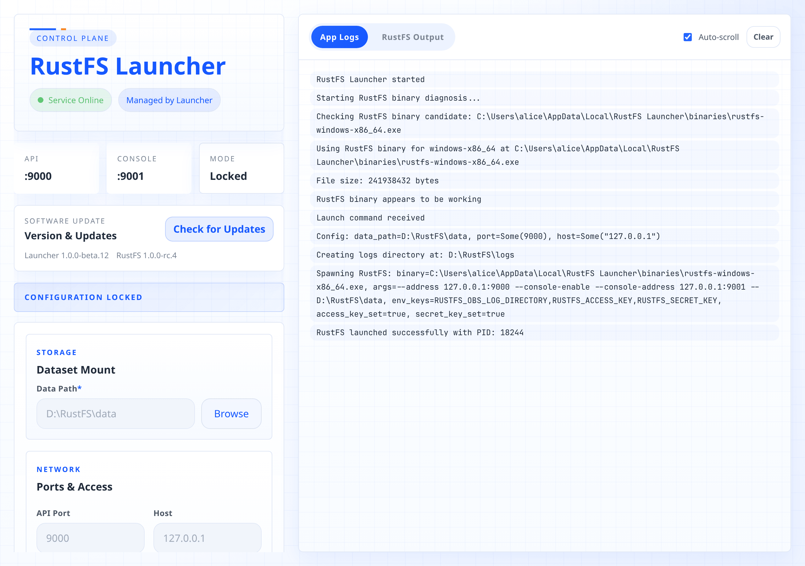
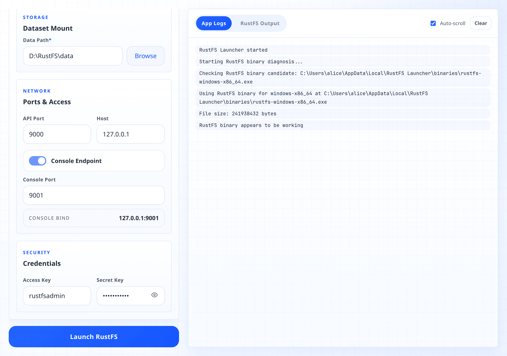
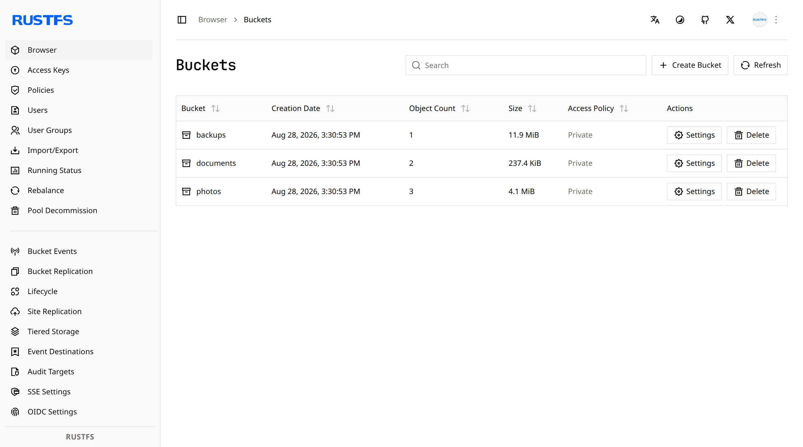
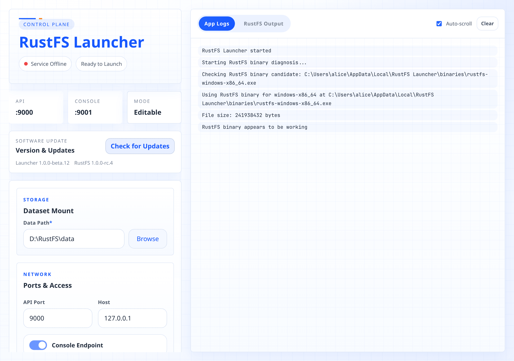

# RustFS Launcher

**English** · [Deutsch](README_DE.md) · [Français](README_FR.md) · [日本語](README_JA.md) · [한국어](README_KO.md) · [简体中文](README_ZH.md) · [हिन्दी](README_HI.md)

RustFS Launcher is a small desktop app that runs [RustFS](https://github.com/rustfs/rustfs), an S3-compatible
object storage server, on your own computer. You pick a folder, press one button, and you get an S3 endpoint
at `http://127.0.0.1:9000`.

The server itself is bundled inside the app. There is nothing else to install, no terminal to open, and no
configuration file to edit.



## What you can do with it

- Run object storage on your laptop for development, testing, or a personal backup target — without Docker.
- Point any S3 client or SDK at `127.0.0.1` and use it like a bucket in the cloud.
- Watch the server: online status, ports in use, and live logs.
- Start and stop RustFS whenever you want. The launcher keeps running in the tray while the server works.
- Update the launcher (and the RustFS build inside it) from the app itself.

## Download

Grab the newest file for your machine from the [releases page](https://github.com/rustfs/launcher/releases).

| Your system | File |
| --- | --- |
| Windows 10 / 11, 64-bit | `rustfs-launcher-windows-x86_64-<version>-setup.exe` (about 50 MB) |
| macOS, Apple Silicon | `rustfs-launcher-macos-aarch64-<version>.app.zip` |
| macOS, Intel | `rustfs-launcher-macos-x86_64-<version>.app.zip` |

Windows on ARM works as well — it runs the x86_64 build through emulation. There is no Linux package yet; on
Linux, run the [RustFS binary](https://github.com/rustfs/rustfs/releases) directly.

The downloads are large because a full RustFS server is packed into the installer.

## Windows, step by step

### 1. Download the installer

Open the [releases page](https://github.com/rustfs/launcher/releases), expand **Assets** on the newest release
and click the file ending in `-setup.exe`. Edge and Chrome sometimes flag installers they rarely see; choose
**Keep** if the browser asks.

### 2. Get past SmartScreen

Double-click the file. If you see **Windows protected your PC**, click **More info**, then **Run anyway**. The
warning shows up because the installer is not signed with a commercial code-signing certificate yet — it is not
a verdict about the file.

### 3. Walk through the installer

The wizard asks the usual questions: welcome, license, install location, Start menu folder.

- The default location is `C:\Users\<you>\AppData\Local\RustFS Launcher`. It installs for your user only, so
  Windows will not ask for administrator rights.
- If your PC is missing the Microsoft WebView2 runtime, the installer downloads it once. This step needs an
  internet connection.
- On the last page, leave **Run RustFS Launcher** ticked. You can also let it create a desktop shortcut.

Afterwards the app lives in the Start menu under **RustFS Launcher**.

### 4. Create a folder for your data

RustFS stores objects in a folder you choose, and it expects that folder to exist already. Create something
like `D:\RustFS\data` in Explorer first. An empty folder on a drive with free space is the safest choice.

The server keeps its own log files in a `logs` folder next to the one you picked — `D:\RustFS\logs` in this
example.

### 5. Fill in the form



| Field | What it means |
| --- | --- |
| **Data Path** | The folder from step 4. Click **Browse**, or drag a folder onto the window. This is the only required field. |
| **API Port** | The S3 endpoint port. `9000` unless something else on your PC already uses it. |
| **Host** | `127.0.0.1` keeps the server private to this computer. Use `0.0.0.0` to let other machines on your network reach it. |
| **Console Endpoint** | Turn this on if you want the RustFS web console. It runs on its own port, `9001` by default. |
| **Access Key** / **Secret Key** | The credentials your S3 client will use. They default to `rustfsadmin` / `rustfsadmin`, so change them if the server is reachable from outside your machine. |

Your entries are remembered, so the next start is a single click.

### 6. Press Launch

Click **Launch RustFS**. Within a second or two the header switches to **Service Online / Managed by
Launcher**, the form locks itself, and **App Logs** shows what the launcher did — which binary it picked, the
arguments it used, and the process ID it got back.

If the launch fails, the reason is in that same log panel. The most common ones are a data folder that does not
exist and a port that is already taken.

### 7. Use the storage

While the service is online, the **API** and **Console** cards at the top become clickable. **Console** opens
the web interface; **API** opens the S3 endpoint itself, and a browser only gets an XML answer from it — that
address is meant for S3 clients.

Point an S3 client at the endpoint:

```bash
aws --endpoint-url http://127.0.0.1:9000 s3 mb s3://demo
aws --endpoint-url http://127.0.0.1:9000 s3 cp report.pdf s3://demo/
```

Use your access key and secret key as the credentials, `us-east-1` as the region, and path-style addressing.

In the console, sign in with that same access key and secret key.



### 8. Stop the server, or leave it running

**Stop RustFS** shuts the server down and unlocks the form again.

Closing the window does not quit anything — the launcher hides in the notification area and RustFS keeps
serving. Click the tray icon to bring the window back, or right-click it and choose **Quit**, which stops the
server and closes the app.

### 9. Uninstall

Remove **RustFS Launcher** from **Settings → Apps → Installed apps**, or use the uninstaller in its Start menu
folder. Your data folder is left alone; delete it yourself if you no longer need the objects in it.

## macOS

1. Unzip the `.app.zip` and drag **RustFS Launcher** into **Applications**.
2. The first launch is blocked, because the release builds are not notarized by Apple. Either right-click the
   app and choose **Open**, or clear the quarantine flag from a terminal:

   ```bash
   xattr -cr "/Applications/RustFS Launcher.app"
   open "/Applications/RustFS Launcher.app"
   ```

3. From there, everything works as described in steps 4 to 8 above. Clicking the Dock icon brings the window
   back after you close it.

## A tour of the window



**Status badges.** The first badge is about the server: *Service Online* means something answers on the host
and port you configured. The second one is about who owns that process:

| Badge | Meaning |
| --- | --- |
| Ready to Launch | Nothing is running on that port. |
| Managed by Launcher | The launcher started RustFS and can stop it again. |
| Detected Externally | The port answers, but the process was not started here — for example a RustFS you launched from a terminal. The stop button stays disabled in that case. |

**Summary cards.** API and Console show the ports and open them in a browser once the service is online. Mode
tells you whether the form is *Editable* or *Locked* because RustFS is running.

**Version & Updates.** Shows the launcher version and the RustFS version built into it, and checks for a newer
release when you ask it to.

**Logs.** *App Logs* is the launcher talking: what it looked for, what it started, why something failed. *RustFS
Output* shows whatever the server prints on its console — recent RustFS builds write their detailed logs to
files instead, so this tab is often quiet. Auto-scroll follows new lines; Clear empties both tabs.

## Where things end up

| What | Where |
| --- | --- |
| Your objects | The data folder you chose, plus a hidden `.rustfs.sys` folder for metadata |
| Server logs | A `logs` folder next to the data folder |
| Launcher settings | Stored by the app itself; no file for you to edit |
| The app | `%LOCALAPPDATA%\RustFS Launcher` on Windows, `/Applications` on macOS |

## Updating

Press **Check for Updates** in the Version & Updates card. If a newer release exists, the launcher downloads
it, verifies its signature, and installs it. If RustFS is running, the launcher asks first, then stops the
server before restarting itself. Updates replace the whole app, including the bundled RustFS server.

The signing and release mechanics are documented in [docs/SELF_UPDATE.md](docs/SELF_UPDATE.md).

## When something goes wrong

**"Data path does not exist"** — create the folder in Explorer or Finder first; the launcher does not create it
for you.

**"Port 9000 is already in use"** — another program (or an older RustFS) holds the port. Pick a different API
port, or stop the other program. The same applies to the console port.

**The badge says Detected Externally** — a RustFS is already answering on that host and port, but this launcher
did not start it. Stop that process where you started it, or move the launcher to a different port.

**RustFS Output stays empty** — that is normal for recent RustFS builds; they write their logs into the `logs`
folder next to your data directory. Use App Logs to see what the launcher itself is doing.

**The browser shows XML like `AccessDenied`** — that is the S3 API answering a browser, and nothing is broken.
Use the Console card for a web interface, and give the API address to an S3 client instead.

**The window disappeared** — closing the window only hides it. Use the tray icon on Windows, or the Dock icon on
macOS.

**macOS says the app "cannot be opened"** — see the quarantine command in the macOS section above.

## Building it yourself

You need [Rust](https://rustup.rs/), [Node.js](https://nodejs.org/), and [Trunk](https://trunkrs.dev/)
(`cargo install trunk`).

```bash
./build.sh          # build.bat on Windows — downloads the RustFS binary for your platform
cargo tauri dev     # run it with hot reload
cargo tauri build   # produce installers
```

Run `make pre-commit` before sending a pull request; it runs formatting, Clippy, the frontend build, and the
tests. More detail lives in [AGENTS.md](AGENTS.md), the release workflows in
[.github/ACTIONS.md](.github/ACTIONS.md). For editing, VS Code with the
[Tauri](https://marketplace.visualstudio.com/items?itemName=tauri-apps.tauri-vscode) and
[rust-analyzer](https://marketplace.visualstudio.com/items?itemName=rust-lang.rust-analyzer) extensions is a
good setup.

## License

Apache-2.0. See [LICENSE](LICENSE).
